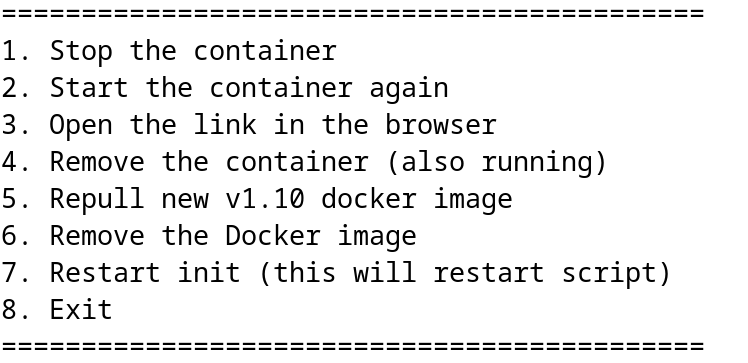

## О проекте

Этот проект представляет собой бэкенд-часть сайта для размещения и просмотра объявлений. Сайт позволяет пользователям регистрироваться, авторизовываться, создавать, редактировать и удалять свои объявления и комментарии к ним. Также сайт поддерживает работу с изображениями и систему доступов для разных типов пользователей.

---

## Технологии

Проект написан на языке Java с использованием следующих технологий:

- Spring Boot - для создания RESTful API
- Swagger - для документирования API
- PostgreSQL - для хранения данных
- Lombok - для упрощения кода

---

## Функционал

Проект реализует следующие функции:

- Регистрация - позволяет пользователю создать учетную запись на сайте, указав свое имя, электронную почту и пароль.
- Вход/выход - позволяет пользователю войти или выйти из своей учетной записи на сайте.
- Получение и обновление профиля - позволяет пользователю просмотреть или изменить свои личные данные, такие как имя, электронная почта, пароль и фотография.
- Смена пароля - позволяет пользователю изменить свой пароль на сайте.
- Просмотр объявлений без авторизации - позволяет любому посетителю сайта просматривать список всех объявлений или одно конкретное объявление с деталями и изображениями.
- Просмотр объявлений, редактирование, удаление с авторизацией - позволяет авторизованному пользователю создавать новые объявления, редактировать или удалять свои существующие объявления.
- Просмотр комментариев без авторизации - позволяет любому посетителю сайта просматривать список всех комментариев к объявлению или один конкретный комментарий с деталями и автором.
- Просмотр, редактирование, удаление комментариев с авторизацией - позволяет авторизованному пользователю создавать новые комментарии к объявлениям, редактировать или удалять свои существующие комментарии.
- Система доступов - ограничивает доступ к разным функциям сайта в зависимости от типа пользователя: анонимный пользователь, авторизованный пользователь или администратор. Пользователю не выводится чужая информация.

---

## Необходимые компоненты:

Для запуска программы необходимы: Docker, Apache Maven, JDK верссии 11 и выше. В случае если нет данных зависимостей их можно устновть выполнив следующие инструкции:

### Для Arch:
C использованием pacman
```shell
$ sudo pacman -S docker maven 
```
или с использованием AUR
```shell
$ yay/paru -S docker maven
```

### Для Ubuntu:
1. Обновите индекс пакета apt и установите пакеты, чтобы разрешить apt использовать репозиторий через HTTPS:
```shell
$ sudo apt-get remove docker docker-engine docker.io containerd runc
$ sudo apt-get update
$ sudo apt-get install \
    ca-certificates \
    curl \
    gnupg
```

2. Добавьте официальный GPG-ключ Docker:
```shell
$ sudo install -m 0755 -d /etc/apt/keyrings
$ curl -fsSL https://download.docker.com/linux/ubuntu/gpg | sudo gpg --dearmor -o /etc/apt/keyrings/docker.gpg
$ sudo chmod a+r /etc/apt/keyrings/docker.gpg
```

3. Используйте следующую команду для настройки репозитория:
```shell
$ echo \
  "deb [arch="$(dpkg --print-architecture)" signed-by=/etc/apt/keyrings/docker.gpg] https://download.docker.com/linux/ubuntu \
  "$(. /etc/os-release && echo "$VERSION_CODENAME")" stable" | \
  sudo tee /etc/apt/sources.list.d/docker.list > /dev/null
```

4. Чтобы установить последнюю версию Docker, jre, jdk и maven запустите:
```shell
$ sudo apt-get install docker-ce docker-ce-cli containerd.io docker-buildx-plugin docker-compose-plugin default-jre default-jdk maven
```

5. Убедитесь, что установка Docker Engine прошла успешно, запустив образ hello-world:
```shell
$ sudo docker run hello-world
```

### Для Fedora

1. Установите пакет dnf-plugins-core (который предоставляет команды для управления вашими репозиториями DNF) и настройте репозиторий.
```shell
$ sudo dnf -y install dnf-plugins-core
$ sudo dnf config-manager \
    --add-repo \
    https://download.docker.com/linux/fedora/docker-ce.repo
```

2. Установите последнюю версию Docker Engine, containerd, Docker Compose и Apache Maven:
```shell
$ sudo dnf install docker-ce docker-ce-cli containerd.io docker-buildx-plugin docker-compose-plugin maven java-11-openjdk.x86_64 java-11-openjdk-devel.x86_64
```

3. Убедитесь, что установка Docker Engine прошла успешно, запустив образ hello-world:
```shell
$ sudo docker run hello-world
```

---

## Запуск проекта

Для работы с проектом созданы 2 скрипта.  

1. Для начала запустите скрипт _docker-shop.sh_ из директории проекта для отображения front-end контейнера написанного на react-js.
```shell
$ ./docker-shop.sh                                                       
```
  
_Данный скрипт представляет собой консольную утилиту для удобства работы с docker контейнером для данного проекта._

2. Для компиляции и запуска backend-части необходимо прописать
```shell
$ ./compile.sh                                                            
```
